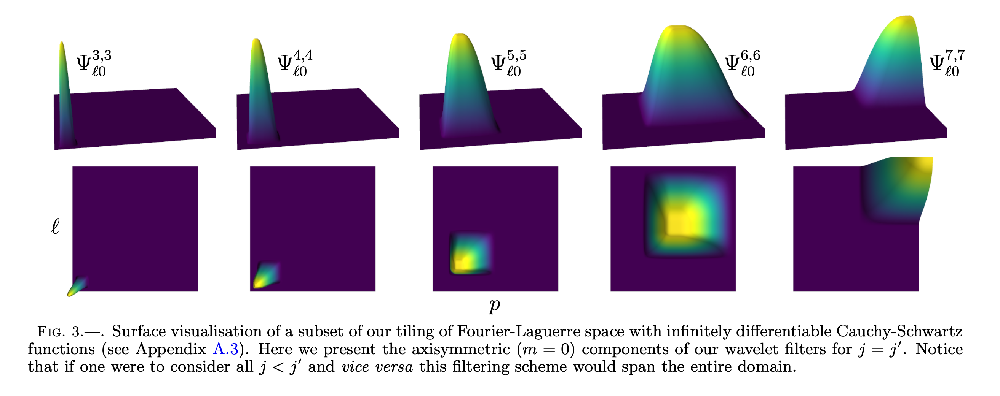
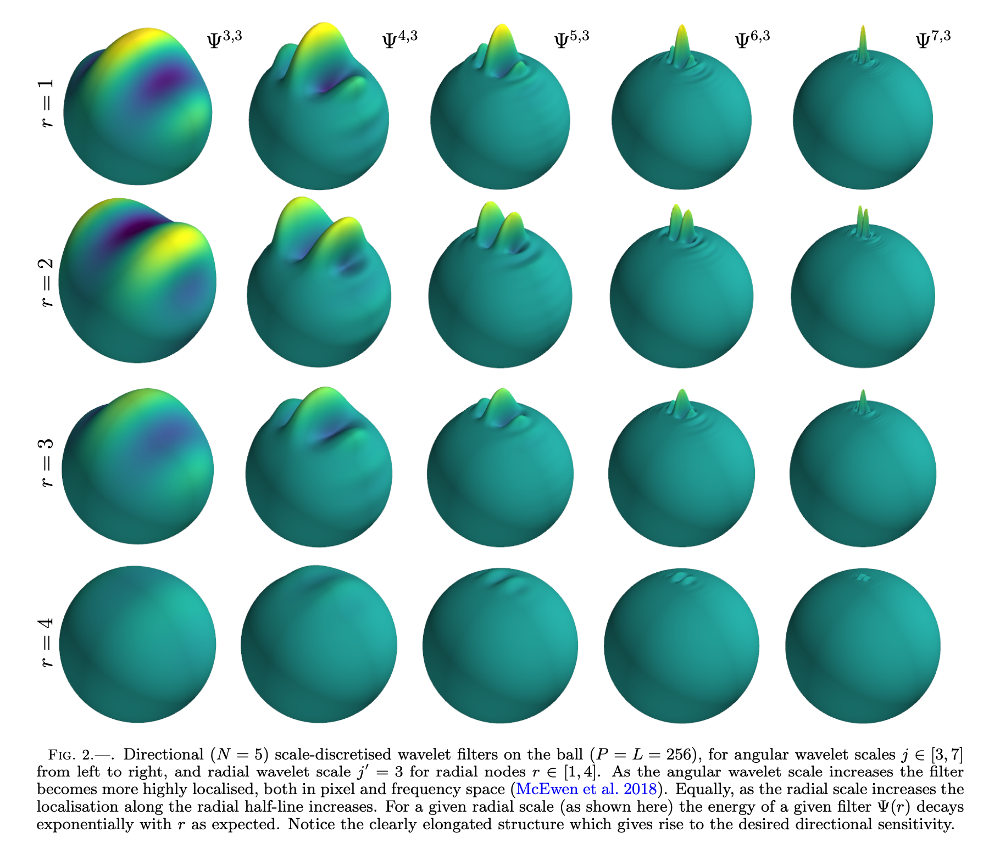
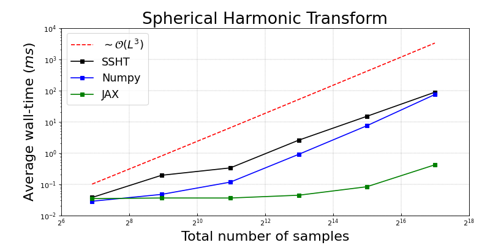
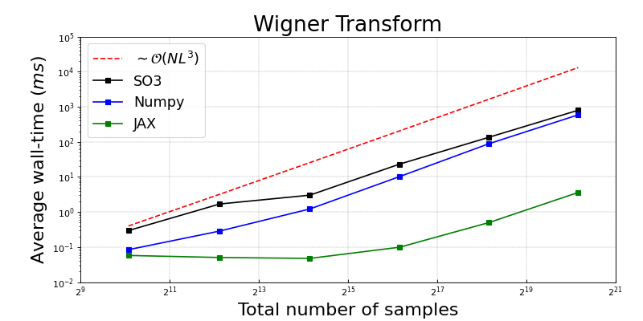
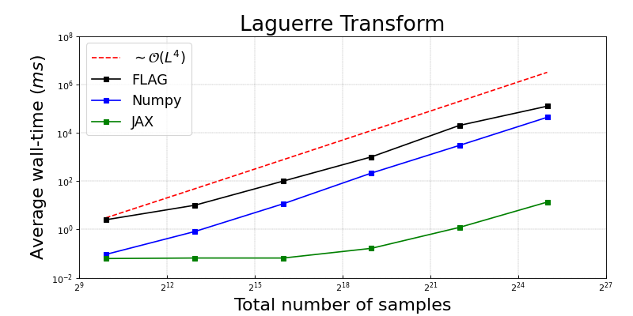
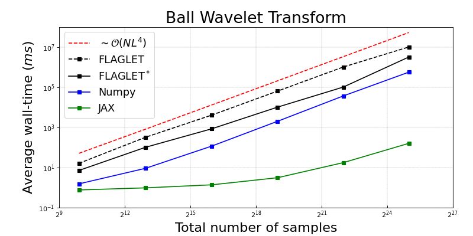

.. image:: https://github.com/astro-informatics/s2ball/actions/workflows/tests.yml/badge.svg?branch=main
    :target: https://github.com/astro-informatics/s2ball/actions/workflows/tests.yml
.. image:: https://codecov.io/gh/astro-informatics/s2ball/graph/badge.svg?token=12JWTZPO96
    :target: https://codecov.io/gh/astro-informatics/s2ball
.. image:: https://img.shields.io/badge/License-MIT-yellow.svg
    :target: https://opensource.org/licenses/MIT
.. image:: https://badge.fury.io/py/s2ball.svg
    :target: https://badge.fury.io/py/s2ball
.. image:: http://img.shields.io/badge/arXiv-2402.01282-orange.svg?style=flat
    :target: https://arxiv.org/abs/2402.01282
.. image:: https://img.shields.io/badge/all_contributors-2-orange.svg?style=flat-square
    :target: #contributors-
.. image:: https://img.shields.io/badge/code%20style-black-000000.svg
    :target: https://github.com/psf/black

===================================================================
|logo| Differentiable and accelerated wavelet transform on the ball
===================================================================

.. |logo| raw:: html

   

`S2BALL` is a JAX package which provides support for automatically 
differentiable and greatly accelerated generalized Fourier transforms on the sphere, 
rotation group, and ball. Furthermore, we support extremely efficient and differentiable 
Wigner-Laguerre wavelets which can be up to 22,000 times faster 
than their ``C`` counterparts, discussed in related works by `Leistedt & McEwen 2012 
<https://arxiv.org/pdf/1205.0792.pdf>`_ and `Price & McEwen 2021 <https://arxiv.org/pdf/2105.05518.pdf>`_.

The transforms `S2BALL` provides are optimally fast but come with a substantial memory 
overhead and cannot be used above a harmonic bandlimit of L ~ 256, at least with current GPU memory 
limitations. That being said, many applications are more than comfortable at these resolutions, for 
which these JAX transforms are ideally suited, *e.g.* geophysical modelling, diffusion 
tensor imaging, multiscale molecular modelling. For those with machine learning in mind, 
it should be explicitly noted that these transforms are indeed equivariant to their respective groups.

Wavelet Filters on the Ball :ringed_planet:
--------------------------------------------

The filters `S2BALL` provides were originally derived by `Leistedt & McEwen 2012 
<https://arxiv.org/pdf/1205.0792.pdf>`_ and are constructed by tesselating both harmonic space 
and the radial half-line with infinitely differentiable Cauchy-Schwartz functions. This tesselation 
gives rise to the follow frequency space localisation 

|filter_support|

The above is the frequency space localisation of the wavelet filters, however one can also view wavelet filters in pixel space. Visualising these filters is somewhat tricky as the ball is a 3-dimensional surface embedded in 4-dimensional space. We can, however, straightforwardly view a spherical slice of the ball for each radial node

|filter_support_pixel|

Installation :computer:
---------------------------

The Python dependencies for the `S2BALL` package are listed in the file
`requirements/requirements-core.txt` and will be automatically installed
into the active python environment by `pip <https://pypi.org>`_ when running

.. code-block:: bash

    pip install .        

from the root directory of the repository. Unit tests can then be
executed to ensure the installation was successful by running

.. code-block:: bash

    pytest tests/  

Alternatively, the `S2BALL` package may be installed directly from PyPi by running 

.. code-block:: bash

    pip install s2ball

Basic Usage :rocket:
---------------------------

To apply the generalised Fourier transforms supported by `S2BALL` one need only 
import the package and apply the respective transform, which is as simple as doing the 
following: 

.. code-block:: Python

    from s2ball.transform import *
    import numpy as np 

    # Load some data
    f = np.load("path_to_your_data.npy")

+-------------------------------------------------------+------------------------------------------------------------+
|and for data on the sphere with shape :math:`[L, 2L-1]`|or data on SO(3) with shape :math:`[2N-1, L, 2L-1]`         |
|                                                       |                                                            |
|.. code-block:: Python                                 |.. code-block:: Python                                      |
|                                                       |                                                            |
|   L = L                                               |   L = L; N = N                                             |
|                                                       |                                                            |
|   # Compute harmonic coefficients                     |   # Compute Wigner coefficients                            |
|   flm = harmonic.forward(f, L)                        |   flmn = wigner.forward(f, L, N)                           |
|                                                       |                                                            |
|   # Sythensise signal f                               |   # Sythensise signal f                                    |
|   f = harmonic.inverse(flm, L)                        |   f = wigner.inverse(flmn, L, N)                           |
+-------------------------------------------------------+------------------------------------------------------------+

+---------------------------------------------------+---------------------------------------------------------+
|or data on the ball with shape :math:`[P, L, 2L-1]`|or with shape :math:`[P, 2N-1, L, 2L-1]`                 |
|                                                   |                                                         |
|.. code-block:: Python                             |.. code-block:: Python                                   |
|                                                   |                                                         |
|   L = L; P = P                                    |   L = L; N = N; P = P                                   |
|                                                   |                                                         |
|   # Compute spherical-Laguerre coefficients       |   # Compute Wigner coefficients                         |
|   flmp = laguerre.forward(f, L, P)                |   flmnp = wigner_laguerre.forward(f, L, N, P)           |
|                                                   |                                                         |
|   # Sythensise signal f                           |   # Sythensise signal f                                 |
|   f = laguerre.inverse(flmp, L, P)                |   f = wigner_laguerre.inverse(flmnp, L, N, P)           |
+---------------------------------------------------+---------------------------------------------------------+

However, for repeated application of these transforms it is optimal to instead precompile 
various kernels which can be placed on device to minimise i/o during *e.g.* training. This 
operational mode can be seen throughout our examples, found `here 
<https://github.com/astro-informatics/s2ball/tree/main/notebooks>`_.

Computational Benchmarking :hourglass_flowing_sand:
--------------------------------------------------

The various generalized Fourier and wavelet transforms supported by `S2BALL` were 
benchmarked against their ``C`` counterparts over a variety of parameter configurations. 
Each benchmark has been averaged over many runs, though here we provide only the mean. 
All CPU based operations were executed on a single core from a AMD EPYC 7702 64-core 
processor, whereas all JAX operations were executed on a single NVIDIA A100 graphics 
processing unit. The Jupyter notebooks for each benchmark can be found `here 
<https://github.com/astro-informatics/s2ball/tree/main/notebooks>`_.

Note that benchmarking is restricted to scalar (spin 0 ) fields, though spin is supported 
throughout `S2BALL`. Further note that for Wigner tests we set N=5, and in our 
Laguerre and wavelet benchmarking we set N=1, as FLAG/FLAGLET otherwise take 
excessive compute. Finally, `S2BALL` transforms trivially support batching and 
so can, in many cases, gain several more orders of magnitude acceleration.
    
|harmonic| |wigner| 

|laguerre| |wavelet|

Contributors ✨
-----------------------------------

Thanks goes to these wonderful people (`emoji
key <https://allcontributors.org/docs/en/emoji-key>`_):

.. raw:: html 

    <embed>
        <table>
        <tbody>
            <tr>
            <td align="center" valign="top" width="16.66%"><a href="https://cosmomatt.github.io"> <b>Matt Price</b></a> <a href="https://github.com/astro-informatics/S2BALL/commits?author=CosmoMatt" title="Code">💻</a> <a href="https://github.com/astro-informatics/S2BALL/pulls?q=is%3Apr+reviewed-by%3ACosmoMatt" title="Reviewed Pull Requests">👀</a> <a href="#ideas-CosmoMatt" title="Ideas, Planning, & Feedback">🤔</a></td>
            <td align="center" valign="top" width="16.66%"><a href="http://www.jasonmcewen.org"> <b>Jason McEwen </b></a> <a href="https://github.com/astro-informatics/S2BALL/commits?author=jasonmcewen" title="Code">💻</a> <a href="https://github.com/astro-informatics/S2BALL/pulls?q=is%3Apr+reviewed-by%3Ajasonmcewen" title="Reviewed Pull Requests">👀</a> <a href="#ideas-jasonmcewen" title="Ideas, Planning, & Feedback">🤔</a></td>
            </tr>
        </tbody>
        </table>
    </embed>

Attribution :books:
-------------------

Should this code be used in any way, we kindly request that the following article is
referenced. A BibTeX entry for this reference may look like:

.. code-block:: 

    @article{price:s2ball, 
        author      = "Matthew A. Price and Alicja Polanska and Jessica Whitney and Jason D. McEwen",
        title       = "Differentiable and accelerated directional wavelet transform on the sphere and ball",
        year        = "2024",
        eprint      = "arXiv:2402.01282"        
    }

This work is provided as part of a collection of `JAX` harmonic analysis packages which include 

.. code-block:: 

    @article{price:s2fft, 
        author      = "Matthew A. Price and Jason D. McEwen",
        title       = "Differentiable and accelerated spherical harmonic and Wigner transforms",
        journal     = "Journal of Computational Physics, submitted",
        year        = "2023",
        eprint      = "arXiv:2311.14670"        
    }
    
You might also like to consider citing our related papers on which this code builds:

.. code-block:: 

    @article{leistedt:flaglets,
        author      = "Boris Leistedt and Jason D. McEwen",
        title       = "Exact wavelets on the ball",
        journal     = "IEEE Trans. Sig. Proc.",
        year        = "2012",
        volume      = "60",
        number      = "12",
        pages       = "6257--6269",        
        eprint      = "arXiv:1205.0792",
        doi         = "110.1109/TSP.2012.2215030"
    }

.. code-block:: 

    @article{mcewen:fssht,
        author      = "Jason D. McEwen and Yves Wiaux",
        title       = "A novel sampling theorem on the sphere",
        journal     = "IEEE Trans. Sig. Proc.",
        year        = "2011",
        volume      = "59",
        number      = "12",
        pages       = "5876--5887",        
        eprint      = "arXiv:1110.6298",
        doi         = "10.1109/TSP.2011.2166394"
    }

.. code-block:: 

    @article{mcewen:so3,
        author      = "Jason D. McEwen and Martin B{\"u}ttner and Boris ~Leistedt and Hiranya V. Peiris and Yves Wiaux",
        title       = "A novel sampling theorem on the rotation group",
        journal     = "IEEE Sig. Proc. Let.",
        year        = "2015",
        volume      = "22",
        number      = "12",
        pages       = "2425--2429",
        eprint      = "arXiv:1508.03101",
        doi         = "10.1109/LSP.2015.2490676"    
    }

License :memo:
---------------

`S2BALL` is released under the MIT license (see `LICENSE.txt <https://github.com/astro-informatics/s2ball/blob/main/LICENCE.txt>`_).

.. code-block::

    We provide this code under an MIT open-source licence with the hope that it will be of use to a wider community.

    Copyright 2024 Matthew Price, Jason McEwen and contributors.

    `S2BALL` is free software made available under the MIT License. For details see the LICENSE file.
