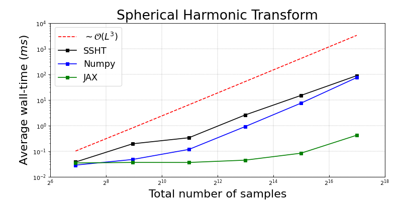
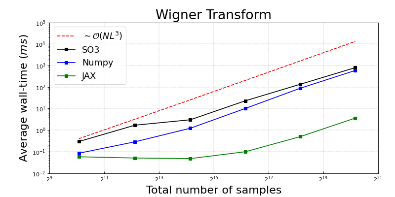
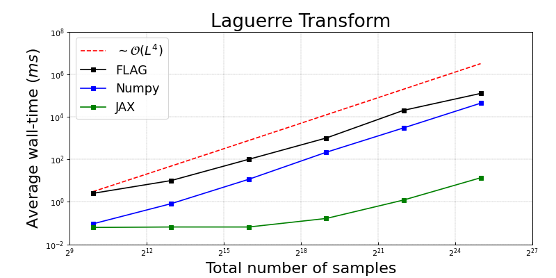
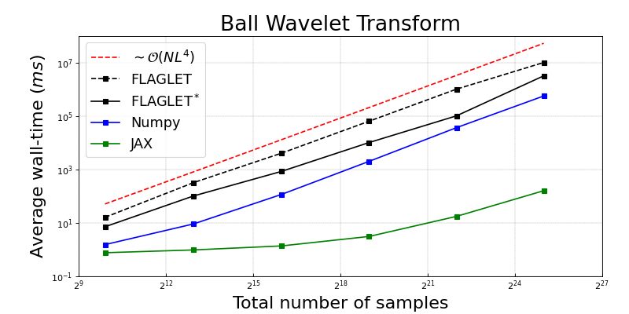

.. image:: https://img.shields.io/badge/GitHub-s2ball-blue.svg?style=flat
    :target: https://github.com/astro-informatics/s2ball
.. image:: https://github.com/astro-informatics/s2ball/actions/workflows/tests.yml/badge.svg?branch=main
    :target: https://github.com/astro-informatics/s2ball/actions/workflows/tests.yml
.. image:: https://codecov.io/gh/astro-informatics/s2ball/branch/main/graph/badge.svg?token=JNYV78Q8NJ 
    :target: https://codecov.io/gh/astro-informatics/s2ball
.. image:: https://img.shields.io/badge/License-MIT-yellow.svg
    :target: https://opensource.org/licenses/MIT
.. image:: http://img.shields.io/badge/arXiv-1205.0792-orange.svg?style=flat
    :target: https://arxiv.org/abs/1205.0792
.. image:: http://img.shields.io/badge/arXiv-2105.05518-orange.svg?style=flat
    :target: https://arxiv.org/abs/2105.05518
.. image:: https://img.shields.io/badge/code%20style-black-000000.svg
    :target: https://github.com/psf/black

|logo| Optimal JAX wavelet transforms on the ball
=================================================

.. |logo| raw:: html

   

`S2BALL` is a JAX package which provides support for automatically 
differentiable and greatly accelerated generalized Fourier transforms on the sphere, 
rotation group, and ball. Furthermore, we support extremely efficient and differentiable 
Wigner-Laguerre wavelets, *i.e.* the directional ball, which can be up to 50,000 times faster 
than their ``C`` counterparts which are discussed in related works by `Leistedt & McEwen 2012 
<https://arxiv.org/pdf/1205.0792.pdf>`_ and `Price & McEwen 2021 <https://arxiv.org/pdf/2105.05518.pdf>`_.

Note that the underlying generalized Fourier transforms are, barring implementation optimizations, 
optimally fast but come with a substantial memory overhead. As such, the authors **do not** 
recommend `S2BALL` be used above a harmonic bandlimit of L ~ 256 with current GPU memory 
limitations. We are developing state-of-the-art JAX recursion based harmonic transforms 
in parallel work, to which we direct the user with higher resolution applications in mind.

That being said, many applications are more than comfortable at lower resolutions, for 
which these JAX transforms are ideally suited, *e.g.* geophysical modelling, diffusion 
tensor imaging. For those with machine learning in mind, it should be explicitly noted 
that these transforms are indeed equivariant to their respective groups.

Basic Usage
===========
To apply the generalised Fourier transforms supported by `S2BALL` one need only 
import the package and apply the respective transform, which is as simple as doing the 
following: 

.. code-block:: Python

    from s2ball.transform import *
    import numpy as np 

    # Load some data
    f = np.load("path_to_your_data.npy")

    # Select your method: JAX is recommended even on CPU for JIT compilation.
    alg = ["numpy", "jax"]

+-------------------------------------------------------+------------------------------------------------------------+
|and for data on the sphere with shape :math:`[L, 2L-1]`|or data on SO(3) with shape :math:`[2N-1, L, 2L-1]`         |
|                                                       |                                                            |
|.. code-block:: Python                                 |.. code-block:: Python                                      |
|                                                       |                                                            |
|   L = L                                               |   L = L; N = N                                             |
|                                                       |                                                            |
|   # Compute harmonic coefficients                     |   # Compute Wigner coefficients                            |
|   flm = harmonic.forward(f, L, alg)                   |   flmn = wigner.forward(f, L, N, alg)                      |
|                                                       |                                                            |
|   # Sythensise signal f                               |   # Sythensise signal f                                    |
|   f = harmonic.inverse(flm, L, alg)                   |   f = wigner.inverse(flmn, L, N, alg)                      |
+-------------------------------------------------------+------------------------------------------------------------+

+---------------------------------------------------+---------------------------------------------------------+
|or data on the ball with shape :math:`[P, L, 2L-1]`|or with shape :math:`[P, 2N-1, L, 2L-1]`                 |
|                                                   |                                                         |
|.. code-block:: Python                             |.. code-block:: Python                                   |
|                                                   |                                                         |
|   L = L; P = P                                    |   L = L; N = N; P = P                                   |
|                                                   |                                                         |
|   # Compute spherical-Laguerre coefficients       |   # Compute Wigner coefficients                         |
|   flmp = laguerre.forward(f, L, P, alg)           |   flmnp = wigner_laguerre.forward(f, L, N, P, alg)      |
|                                                   |                                                         |
|   # Sythensise signal f                           |   # Sythensise signal f                                 |
|   f = laguerre.inverse(flmp, L, P, alg)           |   f = wigner_laguerre.inverse(flmnp, L, N, P, alg)      |
+---------------------------------------------------+---------------------------------------------------------+

However, for repeated application of these transforms it is optimal to instead precompile 
various kernels which can be placed on device to minimise i/o during *e.g.* training. This 
operational mode can be seen throughout our examples, found `here 
<https://github.com/astro-informatics/s2ball/tree/main/notebooks>`_.

Computational Benchmarking
==========================
The various generalized Fourier and wavelet transforms supported by `S2BALL` were 
benchmarked against their ``C`` counterparts over a variety of parameter configurations. 
Each benchmark has been averaged over many runs, though here we provide only the mean. 
All CPU based operations were executed on a single core from a AMD EPYC 7702 64-core 
processor, whereas all JAX operations were executed on a single NVIDIA A100 graphics 
processing unit. The Jupyter notebooks for each benchmark can be found `here 
<https://github.com/astro-informatics/s2ball/tree/main/notebooks>`_.

    **NOTE:**
    Benchmarking is restricted to scalar (spin 0 ) fields, though spin is supported 
    throughout `S2BALL`. Further note that for Wigner tests we set N=5, and in our 
    Laguerre and wavelet benchmarking we set N=1, as FLAG/FLAGLET otherwise take 
    excessive compute. Finally, `S2BALL` transforms trivially support batching and 
    so can, in many cases, gain several more orders of magnitude acceleration.
    
|harmonic| |wigner| 

|laguerre| |wavelet|

License
=======

`S2BALL` is released under the MIT license (see `LICENSE.txt <https://github.com/astro-informatics/s2ball/blob/main/LICENCE.txt>`_).

.. code-block::

     s2ball
     Copyright (C) 2024 Matthew Price, Jason McEwen & Contributors 

     This program is released under the MIT license (see LICENSE.txt).
